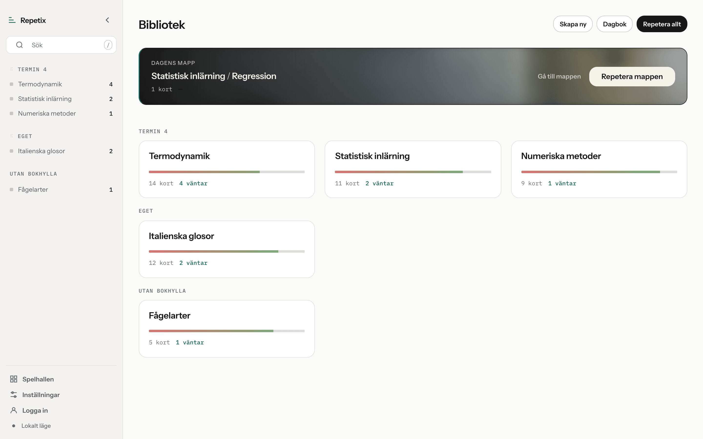
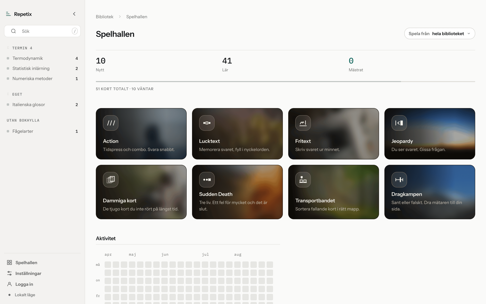
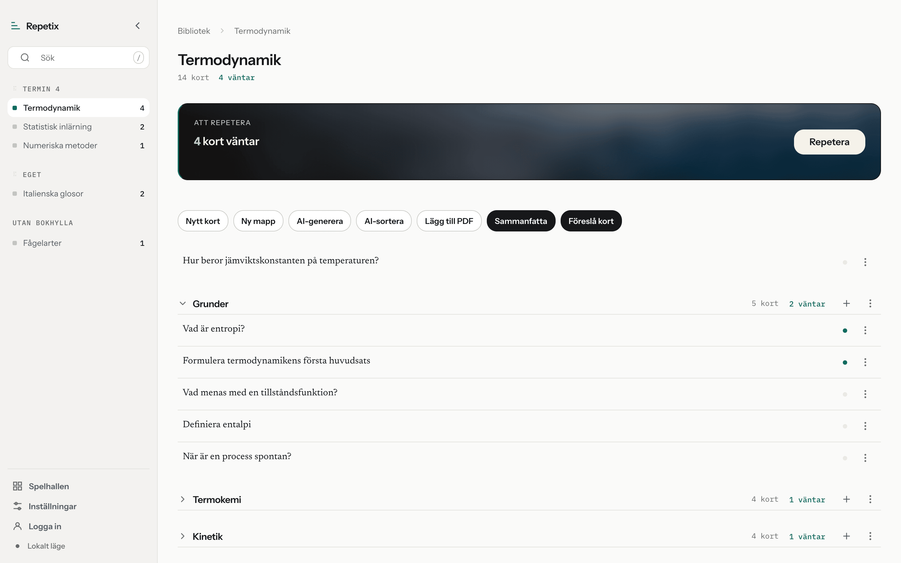

# Repetix

A spaced-repetition flashcard app: decks, scheduled reviews, offline-first
sync, optional AI help, and eight practice modes. Vanilla JavaScript in ES
modules, built with Vite. No framework.

**The interface is entirely in Swedish**, deliberately — no translation layer,
none planned. Source comments and `docs/` are Swedish too; this README is
English so the repository can be read without it.



| | |
|---|---|
|  |  |
| The arcade. Each mode keeps the same backdrop every time. | A deck: what is due today, the AI panels, and the cards by folder. |

## What it does

- **Spaced repetition** — a SuperMemo-2 variant with four grades
  (`src/domain/srs.js`), pure functions, invariant `Igen ≤ Svårt < Bra < Lätt`
  tested across 196 states.
- **Offline first** — reads and writes always go local (localStorage plus an
  IndexedDB mirror) and queue in an outbox. Changes are computed as a diff
  against the last snapshot; deletes are soft, and the review log is
  append-only.
- **Accounts and cloud sync** — Supabase Postgres with row-level security on
  every table, so the barrier sits in the database rather than in client code.
- **Bring your own AI key** — card generation, deck insights, auto-sorting and
  a tutor, all on the user's own provider key, which never reaches the browser.
- **Markdown and LaTeX** on both sides of a card; KaTeX loads only when a card
  actually contains maths.
- **Eight practice modes**, images on cards, and in-app account deletion.

## Run it locally

Needs **Node 22+** (npm 10+).

```bash
git clone https://github.com/Emsurenar/repetix.git
cd repetix
npm install
npm run dev
```

Dev server on <http://localhost:5173> (`PORT` overrides it). It also mounts the
serverless functions in `api/` as Vite middleware, so the same handler files
run locally and on Vercel.

**Without Supabase the app still runs** in local-only mode: no account, no
sync, no AI, all data in that browser. Enough to try it out.

| Command | What it does |
|---|---|
| `npm run dev` | Vite dev server |
| `npm run build` / `npm run preview` | Production build into `dist/`, then serve it |
| `npm test` / `npm run test:watch` | Vitest |
| `npm run lint` / `npm run format` | ESLint, Prettier |

## Set up Supabase

The free tier is enough.

1. **Create a project.** URL and anon key live under *Project Settings → API*.
2. **Run `supabase/migrations/*.sql` by hand in the SQL Editor, one at a time,
   in numeric order.** No CLI step; all of them are idempotent. `0004` is not
   optional — the rate limiter fails closed, so without it `/api/ai` answers
   `503`. Read the comment at the top of `0005` and run its check query first.
3. **Auth.** Email + password sign-up is open. **Turn on email confirmation
   before letting strangers register** — rate limits count per user, so without
   friction at sign-up an attacker just makes more accounts. *Sign in with
   Google* is optional. Under *Authentication → URL Configuration*, add every
   origin you serve from plus `/#aterstall`, or password resets are silently
   rejected.
4. **Environment.** Copy `.env.example` to `.env` and fill it in; it documents
   each variable. Two rules: never put `VITE_` in front of the three server
   variables (that prefix is compiled into the public bundle), and never put a
   **service role key** in `SUPABASE_ANON_KEY`. The app needs no service role
   key anywhere — migration `0002` replaces it with a `security definer`
   function locked to `auth.uid()`.

## AI: bring your own key

No server-side AI key ships with the app. Each user pastes their own under
*Inställningar → provider → API-nyckel*. It is verified against the provider,
encrypted with AES-256-GCM and stored; only a hint like `sk-ant...4f2a` ever
comes back to the browser. Calls go through `POST /api/ai`, which derives the
user from their Supabase token and decrypts the key inside the function.

Anthropic (default `claude-opus-5`), OpenAI, Google and OpenRouter. The model
list is a convenience — any model id can be typed in by hand.

In code, every AI call goes through one function, `callAI()` in
`src/ai/call.js`. Never add a direct provider call elsewhere. The endpoint
contract is [`docs/api-contract.md`](docs/api-contract.md), and it is meant to
change before either implementation does.

## Security

Reviewed in three passes before the repository went public: RLS on every table
for all four operations (`reviews` has no update or delete policy — the log is
append-only even for its owner), DOMPurify on all rendered HTML, no inline
event handlers so the CSP can use `script-src 'self'`, per-user rate limits
counted atomically in Postgres, AES-256-GCM with a fresh IV per encryption.

Known gaps: no sweeper for storage objects orphaned before the deletion code
existed, and no global quota across accounts — an IP-level rule on `/api/*` at
the edge is the missing layer. Details in `docs/OVERLAMNING.md` (Swedish).

Found something? Open an issue, or email the address on the author's GitHub
profile.

## Deploy

`vercel.json` is configured already: Vite preset, `dist/`, the `api/` functions
with a 60-second `maxDuration`, a CSP, and immutable asset caching. Import the
repository into Vercel, add the five environment variables, and add the
resulting URL to Supabase's redirect URLs. The function's own 45-second timeout
must stay strictly below `maxDuration`, or the client gets Vercel's HTML error
page instead of the contract's JSON.

Nothing is Vercel-specific: any static host plus a Node function runtime works.

## Architecture

```
src/
  main.js       entry point: imports styles and modules, calls the init functions
  app/          third-party bundling (KaTeX), initApp, the cloud layer
  core/         state, storage, supabase, sync, local-db, images, encryption
  domain/       srs, model, diff, stats, history — pure functions, no DOM
  ui/           one module per view, plus wiring/ for DOM binding
  games/        one practice mode per module
  ai/           call (the only call layer), models, prompts, wiring
  styles/       tokens, base, components, layout, views/, games/
api/            serverless functions: ai, ai-key, _lib
supabase/       database migrations, run by hand in the SQL Editor
tests/          Vitest
docs/           handover, API contract, design mockups, screenshots
```

Four conventions hold it together:

- **Shared state lives in `S`** (`src/core/state.js`) — a halfway house
  inherited from the app's single-file past, not a final design.
- **Modules define, `main.js` wires.** Every DOM binding sits in an exported
  `initXxx()`, called in an order that matters.
- **`domain/` never imports from `ui/`.**
- **`src/styles/tokens.css` is the only place** a colour, type step or spacing
  value may be defined. No hardcoded hex outside it, no `!important`, light
  mode only, one corner radius for everything. The direction is *Lugn
  precision*, and the mockups in `docs/` are the reference.

`docs/OVERLAMNING.md` is the handover document (Swedish): where the work
stands, what is settled, and which traps have already cost time. `CLAUDE.md`
holds the same rules for an AI coding assistant.

CI runs lint, tests and build on every push and pull request
([`.github/workflows/ci.yml`](.github/workflows/ci.yml)). Deployment is manual,
from Vercel.

## Status and contributions

A personal project, built for one person's studying and published in case it
is useful. It works and is in daily use, but it is not a product: no roadmap,
no support commitment. Fork away. If you open a pull request: keep the
interface Swedish, let comments explain *why*, add tests when you touch
`src/domain/srs.js`, and never commit a `.env`.

## License

[MIT](LICENSE) © 2026 Emre Sunar.

The thumbnails in `public/wash/` are assets, not source: five are the author's
own photographs, the rest come from [Picsum](https://picsum.photos) under the
Unsplash License (free use, no resale of the photographs). Replace them in a
fork you redistribute. Bundled dependencies keep their own licenses (`marked`
and KaTeX MIT, DOMPurify MPL-2.0 or Apache-2.0). The provider marks come from
[Simple Icons](https://simpleicons.org) (CC0); the brands remain trademarks of
their owners and only identify which setting applies to which provider.
